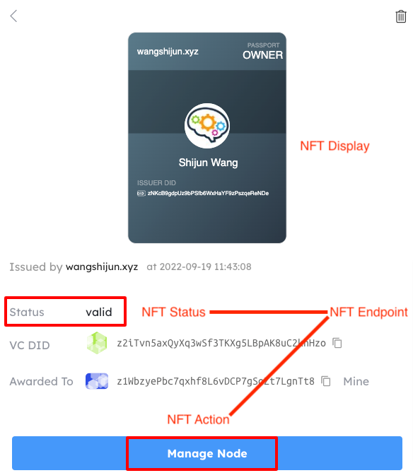
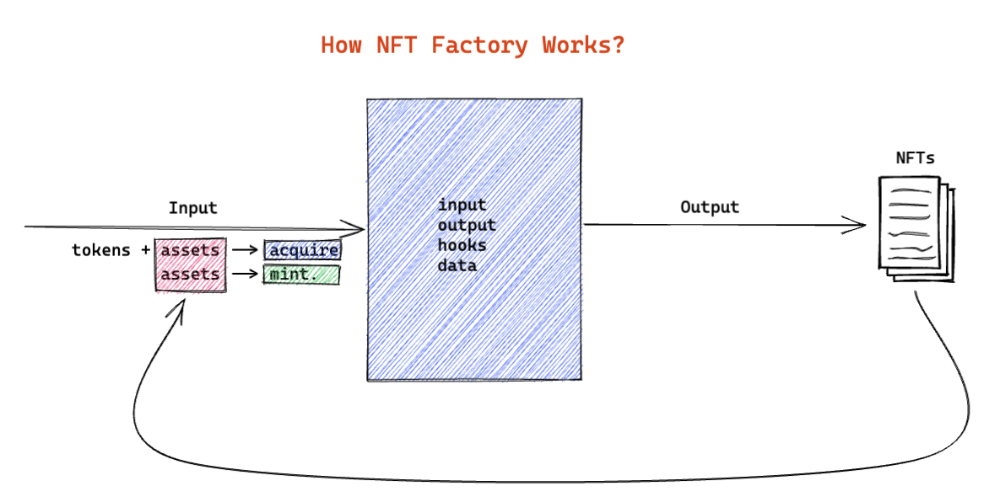

:::Alert
We use the term **NFT** and **Asset** interchangeably throughout this documentation because they mean the same thing on the ArcBlock chain.
:::

## What is NFT?

NFTs (Non-fungible tokens) are cryptographic assets on a blockchain with unique identifiers and metadata that distinguish them from each other.

Unlike [tokens](../tokens), they cannot be traded or exchanged at equivalency. This differs from fungible tokens like cryptocurrencies, which are identical to each other and, therefore, can serve as a medium for commercial transactions.

- NFTs can represent real-world items like artwork and real estate. "Tokenizing" these real-world tangible assets makes buying, selling, and trading them more efficient while reducing the probability of fraud.
- NFTs can also function to represent individuals' identities, property rights, passports, and more.

On the ArcBlock chain, **the essence of an NFT is data**, any data that has actual value and needs to be recorded on the chain can be put on the chain in the form of NFTs. Each NFT is identified by a universal unique address, we call it [DID](../did).

## NFT Use Cases?

The usage scenarios for NFTs are very extensive, when you need to make any records of the data, you can create NFTs and update them through transactions. There are many usage scenarios for NFTs, including but not limited to:

- **Create tickets**: Alice needs to create tickets for her event so that participants can buy tickets to participate in the event. Alice can create ticket NFTs and store them on the chain.
- **Issue certificates**: After the user of the online learning website finishes a course, he can create a course certificate for him, and then ask him to hold a certificate of a course when studying other courses.
- **Membership certificate**: Paid subscription platform users pay for a passport, and check the pass that requires payment to view content.

## NFT Structure

A typical NFT stored on ArcBlock chain has the following structure:

| field         | type                             | required | default | memo                                  | updatable |
| ------------- | -------------------------------- | -------- | ------- | ------------------------------------- | --------- |
| address       | string                           | Yes      | -       | NFT identifier                        | No        |
| owner         | string                           | Yes      | -       | NFT owner identifier                  | Yes       |
| issuer        | string                           | Yes      | -       | NFT issuer identifier                 | No        |
| parent        | string                           | Yes      | -       | NFT Factory identifier                | No        |
| moniker       | string                           | Yes      | -       | Human-readable name                   | No        |
| readonly      | boolean                          | Yes      | false   | is the NFT immutable                  | No        |
| transferrable | boolean                          | Yes      | false   | can NFT be transferred after creation | No        |
| consumedTime  | Date                             | No       | -       | The consume date for the NFT          | Yes       |
| data          | [Any](../transactions/#any-type) | Yes      | false   | the data that makes the NFT unique    | Yes       |
| display       | object                           | No       | null    | the NFT display                       | No        |
| endpoint      | object                           | No       | null    | the NFT endpoint                      | No        |
| tags          | string[]                         | No       | []      | List of tags for later filtering      | No        |

## NFT Extendability

NFTs on ArcBlock chain can either be mutable or immutable depending on the use case. To make NFTs more flexible in real-world applications we have another 2 layers that are totally customizable by developers:

- NFT Display: used to define how the NFT will look like
- NFT Endpoint: used to define dynamic attributes and actions of the NFT

Here is an example of how NFT Display and NFT Endpoint are parsed and displayed in [DID Wallet](https://didwallet.io):



### NFT Display

An NFT can have:

- an immutable display, such as NFT from [Blocklet Store](https://main.abtnetwork.io/explorer/assets/zjdwHAZv23SGqyvi1CMEyaWcsFs6RMLBrHnk)
- a mutable display, such as NFT from [Blocklet Launcher](https://main.abtnetwork.io/explorer/assets/zjdo88xSyb3NRMGWLPEE8qxbAbjaCMdy7ikZ)
- no display at all

NFT display is defined with the following structure:

```typescript
type NFTDisplay = {
  // Can be svg|url|uri
  type: string;

  // Varies according to the type
  // For svg type, content should be the svg itself
  // For url type, content should be the url to fetch the display content, this URL will be requested with the NFT or the NFT address for the display
  // For uri type, content should be the uri to resolve the display content, such as base64 encoded image
  content: string;
};
```

Developers can define NFT display in one of following ways:

- Define `display` field in the `CreateAssetTx`
- Define `output.display` field in `CreateFactoryTx`

### NFT Endpoint

NFT endpoint enables developers to extend NFT capabilities off the chain, such as:

- Display NFT status that may change over time
- Display NFT action that may change over time

NFT endpoint is defined in the following structure:

```typescript
type NFTEndpoint = {
  // the url that serve the endpoint, the url is requested with assetId and locale when displaying the NFT
  id: string;

  // can be public|private, private endpoints are requested with DID Connect
  scope: string;
}
```

A live NFT endpoint example form [Blocklet Launcher](https://launcher.arcblock.io/api/nft/status?locale=en&assetId=zjdo88xSyb3NRMGWLPEE8qxbAbjaCMdy7ikZ).

## NFT Factory

Since some NFTs have standard formats, such as tickets sold in cinemas and parks, developers can use NFT factory to create vending machines on the blockchain: users send transactions to the NFT factory to pay and acquire NFTs that are defined by the NFT factory.

Just like a real-world factory that consumes some materials to produce standard products, the following diagram shows how NFT factory works:



### NFT Factory Transactions

There are a few transactions related to NFT Factory:

- `CreateFactoryTx`: used by developers to create the factory
- `AcquireAssetV3Tx`: used by users to acquire NFT with payment
- `MintAssetTx`: used by factory owners to mint NFT without payment

### NFT Factory Inputs

Users usually need to pay some tokens or consume some NFT to acquire a new NFT, the cost user paid on acquiring NFTs are called factory input, following is a factory input from [Blocklet Launcher](https://main.abtnetwork.io/explorer/txs/F815571D4091AF59CDEDB14092E72C8015A65DC89BC985A9041B9175D9FEE7AE):

```json
{
  "tokens": [
    {
      "address": "z35nNRvYxBoHitx9yZ5ATS88psfShzPPBLxYD",
      "value": "299000000000000000000"
    }
  ],
  "assets": [],
  "variables": [
    {
      "name": "plan",
      "value": "",
      "description": "",
      "required": true
    },
    {
      "name": "tag",
      "value": "",
      "description": "",
      "required": true
    }
  ]
}
```

Factory inputs fall into 3 categories:

- `tokens`: cryptocurrencies required to acquire NFT, a factory can require up to 8 tokens on acquiring, and each token input must specify its token address and price.
- `assets`: NFT to be consumed to acquire NFT, can be NFT address or Factory address, all assets are marked consumed upon successful acquiring
- `variables`: extra info required to acquire NFT, usually collected with a form before the acquiring

### NFT Factory Output

Since all NFTs from a factory share a predefined format, developers define the format as output, a typical factory output is a [mustache](https://mustache.github.io) template that produces the same structure as `CreateAssetTx` upon rendering(acquiring).

Following is the factory output from [Blocklet Launcher](https://main.abtnetwork.io/explorer/txs/F815571D4091AF59CDEDB14092E72C8015A65DC89BC985A9041B9175D9FEE7AE)

```json
{
  "moniker": "BlockletServerOwnershipNFT",
  "data": {
    "type": "json",
    "value": {
      "purchased": {
        "plan": "{{input.plan}}",
        "sku": {
          "name": "{{data.name}}",
          "type": "{{data.type}}",
          "period": "{{data.period}}"
        }
      }
    }
  },
  "readonly": false,
  "transferrable": true,
  "ttl": 0,
  "parent": "{{ctx.factory}}",
  "address": "",
  "issuer": "{{ctx.issuer.id}}",
  "endpoint": {
    "id": "http://1322c65c-znkqyck3vfnye4cyk3yrwfnydgvvkshr9cur.did.abtnet.io/api/nft/status",
    "scope": "public"
  },
  "display": {
    "type": "url",
    "content": "http://1322c65c-znkqyck3vfnye4cyk3yrwfnydgvvkshr9cur.did.abtnet.io/api/nft/display"
  },
  "tags": ["BlockletServerOwnershipNFT", "{{input.tag}}"]
}
```

Data that can be consumed in NFT factory output includes:

- `input.*`: factory input variables, must be set when acquiring/minting
- `data.*`: [factory data object](#nft-factory-data), immutable since factory creation
- `ctx.*` the context when acquiring/minting from the factory
  - `ctx.factory`: the factory address
  - `ctx.id`: the current mint sequence, set to `factory.numMinted + 1` on each mint
  - `ctx.issuer.id`: address for NFT issuer
  - `ctx.issuer.pk`: public key for NFT issuer
  - `ctx.issuer.name`: name for NFT issuer(account moniker)
  - `ctx.owner`: address of NFT owner

### NFT Factory Hooks

NFT

### NFT Factory Data

The NFT factory can have data attached to it on creation, the data can be used in NFT output templates upon acquiring/minting.

- NFT factory data is copied from the `CreateFactoryTx`
- NFT factory data should be [Any Type](../transactions#any-type)

## NFT Security

### Privacy considerations

Once the NFT is stored on the chain, anyone with the NFT address can view all the information stored in the NFT state. In theory, any data can be stored in the NFT. As for what kind of data is stored, the developer can choose according to the actual scenario:

- If NFT data is weakly typed, no privacy protection is required: for example, the certificate data can be stored in plain JSON, so that is fully publicly verifiable.
- If NFT data is strongly typed, some privacy protection requirements are required: NFT data can be saved in the serialized format of [Any Type](../transactions#any-type), no one can directly decode the NFT data without the NFT data proto-buffer, but technically it is possible to view some of the fields
- If NFT data is sensitive: such as contracts, pay slips, etc., to protect the security of NFT data, the data should only contain the hash of the original data, the original data should go into an off-chain database

### Prevent counterfeiting

ArcBlock chain has built-in NFT anti-counterfeiting logic, that is, 2 identical NFTs are not allowed. However, during the app development process, the developer may mistake the fake NFT for the correct NFT when the verification logic is not strict enough, one solution to this is attaching the issuer's signature on NFT creation so that it can be easily verified.
