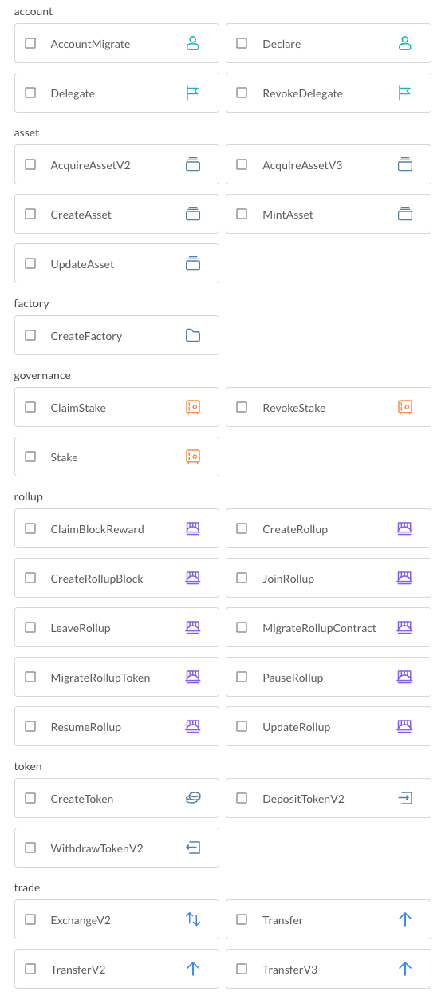

A transaction must be encoded and signed by the sender's [wallet](../wallets), once sent to the blockchain, it's decoded and verified, and then executed and appended to the ledger.

- A transaction is identified by `hash` similar to other blockchains such as Bitcoin and Ethereum.
- A transaction is encoded as binary before being signed and sent to the blockchain.
- A transaction is decoded and formatted before being displayed on the blockchain explorer.

## Transaction Structure

To make transactions flexible and extensible, we use a mail-like structure to define a transaction:

- `envelope` = `outer transaction`: contains required fields for all transactions, such as `sender`, `signature`
- `letter` = `inner transaction`: the actual transaction content, such as `DeclareTx`, `DelegateTx`

You can inspect the "Raw Transaction" on [transaction detail](https://beta.abtnetwork.io/explorer/txs/75A57414CE65375A1C4A4BA52F5D1305CD02567F8949718946394AF525DF78CA) from the explorer to get a better understanding of the structure.

### Outer Transaction

The outer transaction structure is defined as follows:

```typescript
type Transaction = {
  from: string; // the transaction sender address
  pk: string; // the transaction sender public key
  nonce: number;
  chainId: string; // must match with the chain
  delegator: string;
  signature: string; // the transaction sender's signature
  signatures: Array<Multisig>; // signatures from other parties, default to empty
  itx: Any;
};
```

### Inner Transaction (itx)

The inner transaction structure varies across different transaction types. Here are some examples:

```typescript
type DeclareTx = {
  moniker: string;
  issuer: string;
  data?: Any;
};

type TransferV2Tx = {
  to: string;
  assets: Array<string>;
  tokens: Array<{
    address: string;
    value: string;
  }>;
  data?: Any;
};
```

:::Alert
The inner transaction is decoded and notated as `itxJson` in blockchain explorer for better readability.
:::

### Transaction Types

The transaction filter from blockchain explorer lists all supported transaction types supported. Each transaction type defines a structure that can be used in `itx`.



### Transaction Data

Each transaction can have a `data` field that is `Any` type, see next section.

### Any Type

**Any** type is widely used in transactions to encode data that belongs to the same field but has different types and shapes:

```typescript
type Any = {
  type: string;
  value: any;
};
```

**Any** usage in a transaction:

- `itx` field on the outer transaction is used to attach the inner transaction, which can be any of the supported types.
- `data` filed on the inner transaction is used to attach optional data that can be any type, such as `json` and `vc`

## Transaction Size Limit

To protect the blockchain from abuse, there are hard limits for each transaction size, transactions that exceeds the size limit will fail at the verification phase.

The current size limit is:

```js
'fg:t:account_migrate': 348,
'fg:t:create_asset': 65881,
'fg:t:create_factory': 65881,
'fg:t:declare': 664,
'fg:t:exchange_v2': 1691,
'fg:t:transfer': 664,
'fg:t:transfer_v2': 664,
'fg:t:transfer_v3': 4096,
'fg:t:update_asset': 65881,
'fg:t:acquire_asset_v2': 4096,
'fg:t:acquire_asset_v3': 4096,
'fg:t:mint_asset': 4096,
'fg:t:create_token': 664,
'fg:t:deposit_token_v2': 1691,
'fg:t:withdraw_token_v2': 1691,
'fg:t:stake': 4096,
'fg:t:revoke_stake': 664,
'fg:t:claim_stake': 664,
'fg:t:create_rollup': 1691,
'fg:t:update_rollup': 1691,
'fg:t:pause_rollup': 1691,
'fg:t:resume_rollup': 1691,
'fg:t:join_rollup': 1691,
'fg:t:leave_rollup': 1691,
'fg:t:migrate_rollup_contract': 1691,
'fg:t:migrate_rollup_token': 1691,
'fg:t:create_rollup_block': 4096,
'fg:t:claim_block_reward': 1691,
```

## Transaction Fees

- Protocol fees
- Service fees
- Gas fees

## Transaction Signature

### Sender signature

Each transaction carries a signature generated using the sender's secret key. The blockchain and recipient can verify the sender's signature using the sender's public key, which is published on the blockchain. This helps ensure that the transaction content received is exactly as it was when the sender initiated the transaction.

### Multi-party signature
