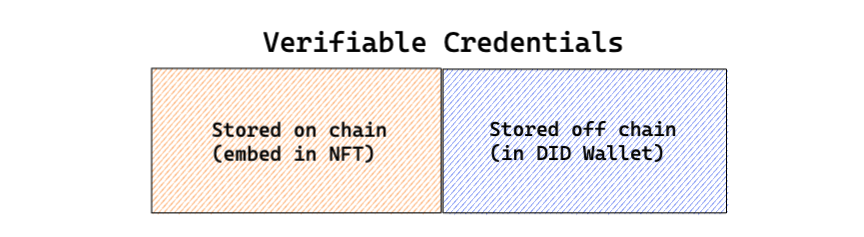

## What are Verifiable Credentials?

Verifiable Credentials are a digital, cryptographically secured version of both paper and digital credentials that people can present to organizations that need them for verification. Imagine digital and instantly verifiable versions of identity documents, academic achievements, licenses, and more.

The core mental model of verifiable credentials is illustrated and clearly explained in [W3C Verifiable Credential Overview](https://w3c.github.io/vc-data-model/#ecosystem-overview).

## Benefits of Verifiable Credentials

- **Instantly verifiable** anywhere at any time within seconds compared to days, weeks, or months with traditional verification processes
- **Tamper-proof** with cryptography, which enables people to store, protect, and share data securely
- **No need to contact the issuer** (e.g. a university or certifying body) to confirm the authenticity
- **Creates immediate trust** between parties
- **User have full control and ownership of their data**, enabled by decentralized identifiers (globally unique identifiers) and Public key cryptography.
- **Provides user privacy** because they can choose which parts of their identity they want to reveal such as showing their age without showing their full name. Or proving they are above a certain age without disclosing their date of birth.
- **No personal data** is stored on the blockchain
- **Portable** as holders can store Verifiable Credentials in their digital wallet and take them anywhere while still being verifiable.

## Use cases for Verifiable Credentials

Verifiable Credentials can be used in many cases:

- User passports to a system that requires authentication
- Membership proof of online/offline communities
- Academic achievement certificates of online training programs
- KYC certificates, such as email, mobile phone

A lot more use cases can be found from the [W3C Verifiable Credential Spec](https://w3c.github.io/vc-data-model/#use-cases-and-requirements).

## Relationship with NFTs

NFTs are always stored on the blockchain, but verifiable credentials do not need to, because a verifiable credential is cryptographically self-proven and tamp-proof. Sometimes an NFT can include a verifiable credential in its data.

## Working with Verifiable Credentials

- See [working with verifiable credentials](/reference/vcs) for how to **issue** and **verify** verifiable credentials with code
- See [did-connect](https://www.didconnect.io/playground/react/?path=/story/connect--request-verifiable-credential) on how to **request** and **verify** verifiable credentials from DID Wallet users.

## References

- [W3C VC Data Model](https://w3c.github.io/vc-data-model/)
