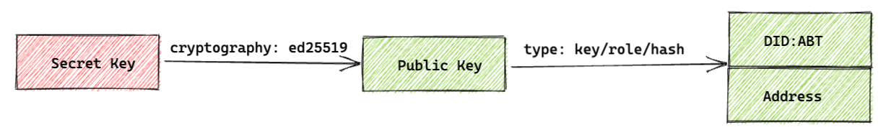

## What is Wallet?

- A wallet usually has a secret key (SK), a public key (PK), and an address ([DID](../did)).
- A wallet can be used to sign a [transaction](../transactions) or other formats of message.
- A wallet can be used to verify a signed message.

The wallet's secret and public keys are important, because:

- The secret key is used to calculate the public key
- The public key is used to calculate the address

It's important to keep the secret keys safe since knowledge of the secret key allows others to spoof signatures to send unauthorized transactions.

## What is Account?

- An account is a data entry that exists in the chain ledger, each account is identified by a unique address ([DID](../did)).
- An account can own many tokens.
- An account can own many NFTs.
- An account can be migrated to a new account.
- A user can have as many accounts as they would like, this is usually achieved with [DID Wallet](https://didwallet.io).
- A user needs at least one account before they can send and receive transactions on the chain.

## Relationship between Wallet and Account

- Most accounts are backed by a wallet (secret key).
- Ownership of the wallet secret key means ownership of funds in the account, if you lose the secret key you lose the funds.

:::Alert{type=success}
Please note that sometimes the terms account and wallet are used interchangeably in this documentation.
:::
