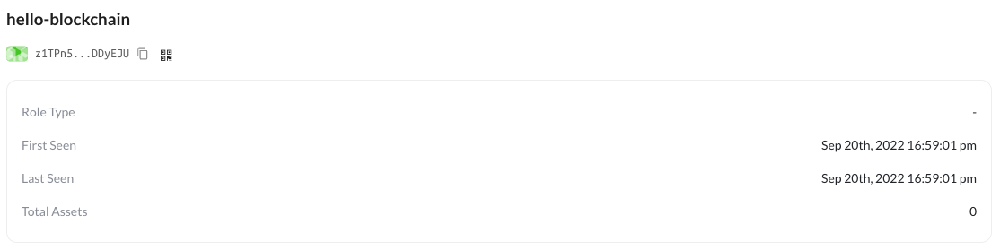

An account is a data entry that's stored in the chain ledger, on-chain accounts are controlled by off-chain wallets, see [understanding accounts and wallets](/conceptual/wallets).

There are several ways to create an account in the ledger.

## Create accounts with DeclareTx

The most intuitive way to create an account is to send a `DeclareTx` to the chain, here are a few examples:

### With account moniker

```javascript
const { fromRandom } = require("@ocap/wallet");
const Client = require("@ocap/client");

const client = new Client("https://beta.abtnetwork.io/api/");
const wallet = fromRandom();

const hash = await client.declare({ moniker: "chain-user", wallet });
```

The `moniker` field will be displayed on the account detail page in [chain explorer](https://beta.abtnetwork.io/explorer/accounts/z1TPn5rYHyxwbyphJ8ZoJECyVhy9tDDyEJU) like this:



### With customized type

Each account can customize the [role type](/conceptual/did#roletype), [key-type](/conceptual/did#keytype) and [hash-type](/conceptual/ddi#hashtype) for its address:

```javascript
const { types } = require("@ocap/mcrypto");
const { fromRandom } = require("@ocap/wallet");
const Client = require("@ocap/client");

const client = new Client("https://beta.abtnetwork.io/api/");
const wallet = fromRandom({
  role: types.RoleType.ROLE_BOT, // default to ROLE_ACCOUNT
  key: types.KeyType.ED25519, // default to ED25519
  hash: types.HashType.SHA3, // default to SHA3
});

const hash = await client.declare({ moniker: "customized-did", wallet });
```

### With account issuer

You can also set the `issuer` field when creating an account, with this field you can relate multiple accounts in a public way:

- `issuer` must be a valid account address
- `issuer` must refer to an existing account in the ledger

```javascript
const hash = await client.declare({
  moniker: "chain-user",
  issuer: "<issuer-address>",
  wallet,
});
```

### With account data

You can also attach some `data` with the account when creating:

- `data` will be immutable upon creation
- `data` can be retrieved with `getAccountState`
- `data` must be structured in the [transaction data format](../../conceptual/transactions)
- `data` size can not be too large because [transaction size limit](../../conceptual/transactions).

```javascript
const hash = await client.declare({
  moniker: "chain-user",
  data: {
    type: "json",
    value: {
      source: "hello-arcblock-chain",
    },
  },
  wallet,
});
```

## Create accounts implicitly

ArcBlock chain also creates accounts implicitly in the following cases so that the user does not need to send `DeclareTx` ahead:

- DelegateTx: when the delegation receiver is not in the ledger, it's created
- TransferV2Tx and TransferV3Tx: when the receiver is not in the ledger, it's created
- DepositTokenV2Tx: when the depositor is not in the ledger, it's created

But there are some pros for accounts created implicitly:

- `moniker` can not be customized
- `issuer` can not be customized
- `data` is empty
